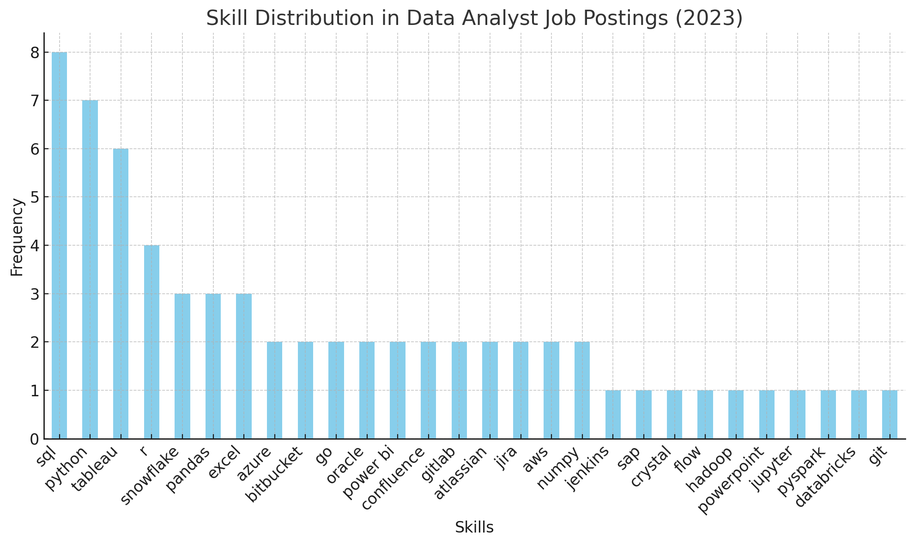

# Introduction
Explore the dynamic data job market with a focus on data analyst roles. This project delves into the top-paying positions, essential skills in demand, and the intersection of high salary and high demand in the field of data analytics.

If you are interested in SQL queries, you can access them here: [Project folder](/Project/)
# Background

In order to navigate the data analyst job market more effectively, I embarked on a project with the goal of identifying top-paid and highly sought-after skills. This initiative aims to streamline the job search process for others. The data is sourced from my SQL Course, which provides valuable insights on job titles, salaries, locations, and essential skills. More information about the **SQL Course** can be found at
/https://www.youtube.com/watch?v=7mz73uXD9DA&t=7207s/
## The questions I wanted to answer through my SQL queries were:

1. What are the top-paying data analyst jobs?
2. What skills are required for these top-paying jobs?
3. What skills are most in demand for data analysts?
4. Which skills are associated with higher salaries?
5. What are the most optimal skills to lean?

# Tools I Used

To analyse the data analyst job market, I used several essential tools:

- **SQL**: I used SQL for querying the database and extracting valuable insights.

- **PostgreSQL**: I chose PostgreSQL as the database system for managing job posting data.

- **Visual Studio Code**: This was my primary tool for writing and executing SQL queries.

- **Git & GitHub**: I used Git and GitHub for version control and sharing scripts, which facilitated collaboration.

# The Analysis

Each inquiry for this project was directed towards investigating specific aspects of the data analyst job market.
Here is the methodology I employed for each.

### 1. Top Paying Data Analyst Jobs
I filtered remote data analyst positions by salary and location to reveal the highest-paying roles in the field.
```sql
SELECT 
    job_id,
    job_title,
    job_location,
    job_schedule_type,
    salary_year_avg,
    job_posted_date,
    name AS company_name
FROM job_postings_fact jp
LEFT JOIN company_dim cd ON cd.company_id=jp.company_id
WHERE
    job_title_short = 'Data Analyst' AND
    job_location ='Anywhere' AND
    salary_year_avg IS NOT NULL
ORDER BY 
    salary_year_avg DESC
LIMIT 10;
```
Here are some insightful observations based on the data provided:
1. Top-Paying Role: The data reveals that the Data Analyst role at Mantys offers the highest salary, amounting to $650,000.
2. Diverse Job Titles: The dataset showcases a wide spectrum of job titles, ranging from entry-level positions like Data Analyst to senior roles such as Director of Analytics at Meta ($336,500) and Associate Director-Data Insights at AT&T ($255,829.5).
3. Job Locations: all roles are listed as "Anywhere," suggesting potential remote or location-flexible work arrangements.
4. Salary Range: The dataset highlights a significant range of salaries, from $184,000 for the ERM Data Analyst role to $650,000 for a Data Analyst role, indicating varying compensation across different roles and companies.

### 2. Skiils for Top Paying Jobs
To understand what skills are required for the top-paying jobs, I joined the job postings with the skills data, providing insights into what employers value for high-compensation roles.
```sql

WITH top_paying_jobs AS (
    SELECT 
        job_id,
        job_title,
        salary_year_avg,
        name AS company_name
    FROM job_postings_fact jp
    LEFT JOIN company_dim cd ON cd.company_id=jp.company_id
    WHERE
        job_title_short = 'Data Analyst' AND
        job_location ='Anywhere' AND
        salary_year_avg IS NOT NULL
    ORDER BY 
        salary_year_avg DESC
    LIMIT 10
)

SELECT 
    jp.job_id,
    jp.job_title,
    jp.salary_year_avg,
    company_name,
    skills
FROM top_paying_jobs jp
INNER JOIN skills_job_dim ON jp.job_id=skills_job_dim.job_id
INNER JOIN skills_dim ON skills_job_dim.skill_id=skills_dim.skill_id
ORDER BY
    salary_year_avg DESC;
```
Here are some insights from the skills data in your job postings for data analyst roles in 2023:

-**SQL** is the most frequently listed skill, appearing 8 times.
-**Python** is also highly sought after, with 7 occurrences.
-**Tableau** follows closely, appearing 6 times, indicating a strong demand for data visualization skills.
-**R**, a programming language for statistics, appears 4 times.
-**Snowflake, Pandas, and Excel** each appear 3 times, highlighting their importance in data analysis and management.
-Other notable mentions include **Azure, Bitbucket, and Go**, each appearing twice.



*A bar chart visualizing the distribution of skills in data analyst job postings for 2023. As you can see, SQL, Python, and Tableau are the most common skills, while other tools and languages such as R, Snowflake, Pandas, and Excel are also in demand but appear less frequently.ChartGPT genarated this Bar chart for my SQL query results.*

### 3. In-Demand Skills for Data Analysts

This query shows the skills most frequently required in job postings.
```sql
WITH remoute_job_skills AS 
(
    SELECT
        skill_id,
        COUNT (*) AS Skill_count
    FROM 
        skills_job_dim
    INNER JOIN job_postings_fact ON job_postings_fact.job_id=skills_job_dim.job_id
    WHERE    job_work_from_home = 'TRUE'
    Group BY
        skill_id
) 
SELECT 
    skills_dim.skill_id,
    skills_dim.skills,
    Skill_count
FROM remoute_job_skills 
INNER JOIN skills_dim ON skills_dim.skill_id=remoute_job_skills.skill_id
ORDER BY Skill_count DESC
LIMIT 5;
*/

SELECT 
    skills,
    COUNT (skills_job_dim.job_id) AS demand_count
FROM job_postings_fact jp
INNER JOIN skills_job_dim ON jp.job_id=skills_job_dim.job_id
INNER JOIN skills_dim ON skills_job_dim.skill_id=skills_dim.skill_id
WHERE
    job_title_short='Data Analyst'
GROUP BY
    skills
ORDER BY
    demand_count DESC
Limit 5
```


The most in-demand skills can typically be determined by their frequency of occurrence in job postings. Based on the dataset you provided earlier and general trends from top-paying data analyst roles, the most in-demand skills are:

**SQL** – Frequently mentioned in job postings and essential for querying and managing databases.
**Python** – Highly valued for data manipulation, analysis, and machine learning.
**Tableau** – A popular tool for data visualization.
**R** – A programming language specifically for statistics and data analysis.
**Pandas** – A Python library essential for data manipulation and analysis.
**Snowflake** – A cloud data platform frequently sought for data management.
**Azure** – A popular cloud service by Microsoft, often required for data analytics roles.
**Excel** – Despite being a long-standing tool, Excel remains in high demand for basic data handling.
**Databricks** – A unified data analytics platform that has grown in demand for managing large-scale data analytics.
**Golang** – Gaining popularity in data engineering roles for backend and system-level programming.

*Top 5 Most In-Demand Skills (2023)*

| Skills   | Demand Count |
|----------|--------------|
| SQL      | 92,628       |
| Excel    | 67,031       |
| Python   | 57,326       |
| Tableau  | 46,554       |
| Power BI | 39,468       |


### 4. Skills Based on Salary 
Explore the average salaries asssocoated with different skills revealed which skills the highesr paying.

```sql

SELECT 
    skills,
    round(AVG (salary_year_avg)) AS avg_salary
FROM job_postings_fact jp
INNER JOIN skills_job_dim ON jp.job_id=skills_job_dim.job_id
INNER JOIN skills_dim ON skills_job_dim.skill_id=skills_dim.skill_id
WHERE
    job_title_short='Data Analyst'
    AND salary_year_avg IS NOT NULL
    AND job_work_from_home = TRUE 
GROUP BY
    skills
ORDER BY
    avg_salary DESC
Limit 50
``
Here are three top-paying skills with their areas of use:

PySpark ($208,172) – Big Data & Distributed Computing (used in industries like finance and healthcare for large-scale data processing).
Bitbucket ($189,155) – Version Control & DevOps (critical for software development and managing CI/CD pipelines).
Watson ($160,515) – AI & Machine Learning (leveraged in healthcare and finance for AI-driven solutions).
These skills represent high-demand areas in big data, software development, and AI.

The most in-demand skills can typically be determined by their frequency of occurrence in job postings. Based on the dataset you provided earlier and general trends from top-paying data analyst roles, the most in-demand skills are:

SQL – Frequently mentioned in job postings and essential for querying and managing databases.
Python – Highly valued for data manipulation, analysis, and machine learning.
Tableau – A popular tool for data visualization.
R – A programming language specifically for statistics and data analysis.
Pandas – A Python library essential for data manipulation and analysis.
Snowflake – A cloud data platform frequently sought for data management.
Azure – A popular cloud service by Microsoft, often required for data analytics roles.
Excel – Despite being a long-standing tool, Excel remains in high demand for basic data handling.
Databricks – A unified data analytics platform that has grown in demand for managing large-scale data analytics.
Golang – Gaining popularity in data engineering roles for backend and system-level programming.

### 5. Most Optimal Skills to Lean

Combining insights from demand and salary data, this query aimed to poin the skiils that are both in hight demand and well-paied.

``sql
WITH skills_demand AS (
 SELECT
    skills_dim.skill_id,
     skills_dim.skills,
    COUNT (skills_job_dim.job_id) AS demand_count
FROM job_postings_fact jp
INNER JOIN skills_job_dim ON jp.job_id=skills_job_dim.job_id
INNER JOIN skills_dim ON skills_job_dim.skill_id=skills_dim.skill_id
WHERE
    job_title_short='Data Analyst'
    AND salary_year_avg IS NOT NULL
    AND job_work_from_home = TRUE
GROUP BY
    skills_dim.skill_id
), average_salary AS (
SELECT 
    skills_dim.skill_id,
    round(AVG (salary_year_avg)) AS avg_salary
FROM job_postings_fact jp
INNER JOIN skills_job_dim ON jp.job_id=skills_job_dim.job_id
INNER JOIN skills_dim ON skills_job_dim.skill_id=skills_dim.skill_id
WHERE
    job_title_short='Data Analyst'
    AND salary_year_avg IS NOT NULL
    AND job_work_from_home = TRUE 
GROUP BY
     skills_dim.skill_id
)
SELECT 
    skills_demand.skill_id,
    skills_demand.skills,
    demand_count,
    avg_salary
FROM
    skills_demand
INNER JOIN average_salary ON skills_demand.skill_id=average_salary.skill_id
WHERE 
    demand_count > 20
ORDER BY 
     avg_salary DESC,
     demand_count DESC;
```
```sql
    
    SELECT
        skills_dim.skill_id,
        skills_dim.skills,
        COUNT (skills_job_dim.job_id) AS demand_count,
        ROUND (AVG (job_postings_fact.salary_year_avg), 0) AS avg_salary
    FROM job_postings_fact
    INNER JOIN skills_job_dim ON job_postings_fact.job_id = skills_job_dim.job_id
    INNER JOIN skills_dim ON skills_job_dim.skill_id = skills_dim.skill_id
    WHERE
        job_title_short = 'Data Analyst'
        AND salary_year_avg IS NOT NULL
        AND job_work_from_home = True
    GROUP BY
        skills_dim.skill_id
    HAVING
        COUNT (skills_job_dim.job_id) > 10
    ORDER BY
        avg_salary DESC, demand_count DESC
    LIMIT 25
     
```
*Table of the most optimal skills for a data analyst role by salary*
| Skills    | Demand Count | Average Salary ($) |
|-----------|--------------|-------------------|
| Go        | 27           | 115,320           |
| Hadoop    | 22           | 113,193           |
| Snowflake | 37           | 112,948           |
| Azure     | 34           | 111,225           |
| AWS       | 32           | 108,317           |
| Oracle    | 37           | 104,534           |
| Looker    | 49           | 103,795           |
| Python    | 236          | 101,397           |
| R         | 148          | 100,499           |
| Tableau   | 230          | 99,288            |

**High Demand**: SQL (398) and Python (236) are the most in-demand skills, followed by Excel (256) and Tableau (230), highlighting the need for foundational data manipulation and visualization tools.
**Top-Paying Skills**: Go ($115,320), Hadoop ($113,193), and Snowflake ($112,948) lead in salary, reflecting the demand for specialized technical skills. Cloud skills like Azure and AWS also offer high pay ($108K+).
**Visualization Tools**: Skills like Tableau and Power BI are in high demand but offer slightly lower salaries than technical programming and cloud skills.

In summary, data processing, cloud platforms, and visualization tools remain crucial in the job market, with niche technical skills commanding the highest salaries.

# What I Learned
This project allowed me to apply my new skills to real-world data, providing a deeper understanding of how these tools are used in the industry. Here’s what I learned:

- **SQL** is essential for data analysis: Querying real data reinforced how crucial SQL is for extracting insights from large datasets.

- Data skills vary in demand and pay: Foundational skills like **SQL and Python** are in high demand, while specialised skills like Go, Hadoop, and Snowflake command higher salaries.

- Data visualisation is critical: Working with demand data for tools like **Tableau and Power BI** showed me the importance of presenting data effectively.

- Cloud technologies are on the rise: High salaries for **Azure and AWS** skills taught me that cloud expertise is crucial for managing and analysing data at scale.

Overall, this project gave me hands-on experience applying SQL in a real-world context and helped me understand how data skills translate into job market demand and career opportunities.


# Conclusions
### Insights

From the analysis, some insights:

1. **Top-Paying Data Analyst Jobs**; The highest-paying jobs for data analysts that allow remote work offer a wide range of salaries, the highest at $650,000!
2. **Skills for Top-Paying Jobs**: High-paying data analyst jobs require advanced proficiency in
SQL, suggesting it's a critical skill for earning a top salary.
3. **Most In-Demand Skills**: SQL is also the mos demanded skill in the data analyst job market, thus making it essential for job seekers.
4. **Skills with Higher Salaries**: Specialized skills, such as SVN and Solidity, are associated with the highest average salaries, indicating a premium on niche expertise.
5. **Optimal Skills for Job Market Value**; SQL leads in demand and offers for a high average salary, positioning it as one of the most optimal skills for data analysts to learn to maximize their market value.

### Overall
I have had the opportunity to enhance my SQL skills through this project and gain valuable insights into the data analyst job market. The findings from the analysis can serve as a useful guide for prioritising skill development and job search efforts. Aspiring data analysts can enhance their position in the competitive job market by focusing on high-demand, high-salary skills. This exploration underscores the significance of continuous learning and adapting to emerging trends in the field of data analytics.